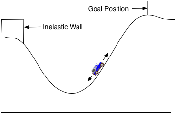
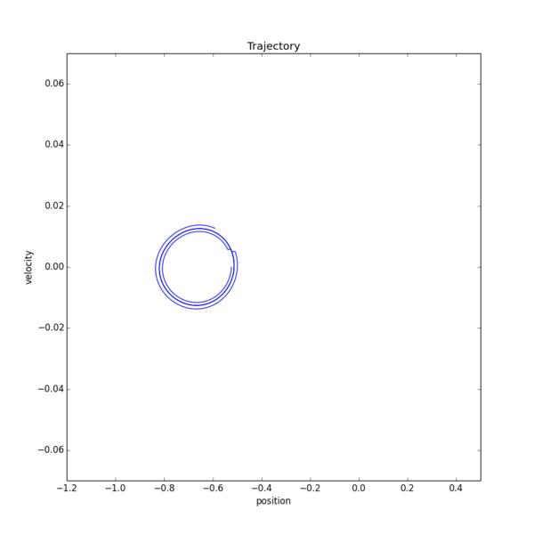

# RL 

Reinforcement Learning (RL) refers to a class of algorithms used in Sequential Decision Making problem.
The main idea is to design a good controler (agent) able to interact with a system in order to maximize some kind of 
reward.
In RL, the data comes in form of trajectories (for example timeseries), and at some point a given agent can take a decision 
that will affect the observations. The feedback about the actions is partial, which is a notable difference with Supervised Learning
algorithms. The agent's intervention usually yield a reward that he want to maximize. This reward will shape the behavior of the system .

In the following we consider two types of problems:

* Batch Learning
* Online Learning

The code used to generate the trajectories, perform simulation and the tools used to 
test RL algorithm were provided with the subject. The original source (from Matthieu Geist) can be found [here](http://sirien.metz.supelec.fr/depot/SIR/CoursML/SujetsBE/RL/doc/_build/html/index.html).

## Batch Learning

We consider the [mountain car problem](https://en.wikipedia.org/wiki/Mountain_car_problem) : 'the task consists in 
driving an underpowered car up a steep mountain road. The gravity being strong than the car's engine, this requires first moving away from the goal, in order to acquire momentum. 
There are three possible actions: full throttle forward (+1), full throttle reverse (-1) and zero throttle (0). Here the state of the car is given by the position x and the velocity of the car. Read the subject for a detailed description. The reward function is s.t at each time step, we get a negative reward (-1). Hitting the inelastic wall gets us bam -10 and 
reaching the goal gets us +10. In brief, this most optimal behavior is that requires the least time (the least number of maneuvers) to reach the goal.

We tested approximate dynamic programming. Given a simulator before hand, we tried fittedQ and Least Square Policy Iteration (LSPI).
FittedQ and LSPI can be described resp. as approximate versions of value iteration and policy iterations. There are suitable here since our state space is continuous and we are provided with a simulator before hand.

Below are 150 iterations of fittedQ(value iteration) algorithm. We plotted the optimized trajectory and value and policy function. 
Note that LSPI(policy iteration) will require less iterations to converge (5 in our experiments) but each iteration has a higher complexity. 

> The natural trajectory is s.t that an intelligent agent that is starting from the the bottom of the hill will start with small acceleration 
> then will make use of the inertia to gain momentum. At the begining, the agent is basically trying different trajectories they do not end up at the top of the mountain.  However at the end (with the spiral-like plot), as the we move away from the valley, the velocity is 
> gradually increasing until the vehicle has enough momentum to climb the whole mountain road.

> On the left side is plotted the value function. Red is for high value whereas blue one is for lower one.
> Notice that a the beginning almost the value function assignes the same value to the whole state space. But as the iterations go one
> The value function learns which states will cost more to reach. Namely, as the higher the position and velocity are, 
> the more value is associated. We can even somehow foresee what is the optimized trajectory (position and velocity) to follow: we just can start from any position and get to a nearby state that allows more value (i.e where the value function is high)
> On the right side is plotted the policy. Red corresponds to going right, blue to left and green to none. Basically, our learnt policy
> tells us to push left when the velocity is negativity and right on the contrary, this helps to acquire more momentum.
> We can notice however that when we are too far on the left, we'll likely throttle right, to avoid hitting the wall.

The code used to make the practice can be found in `batch/practice.py`.

## Online Learning

TODO 

## References

* Jeremy Fix, H.F Buet, M. Geist and F. Pennerath, [Machine Learning](http://sirien.metz.supelec.fr/spip.php?article91)
* Szepesvári, C. (2010). Algorithms for reinforcement learning. Synthesis lectures on artificial intelligence and machine learning, 4(1), 1-103.